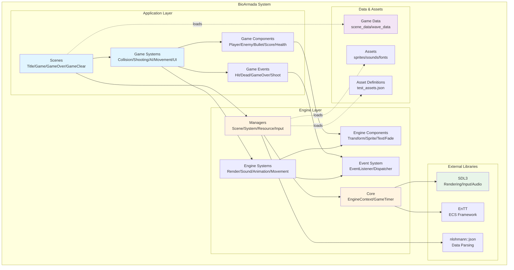
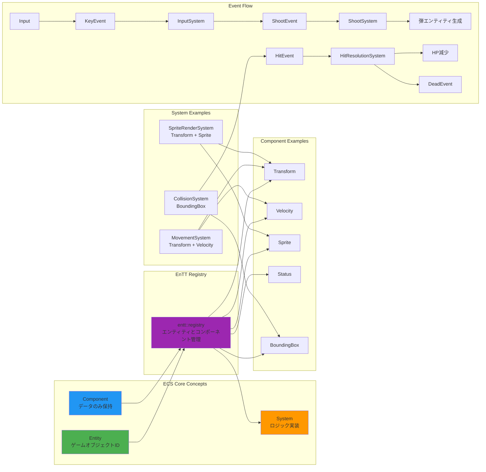
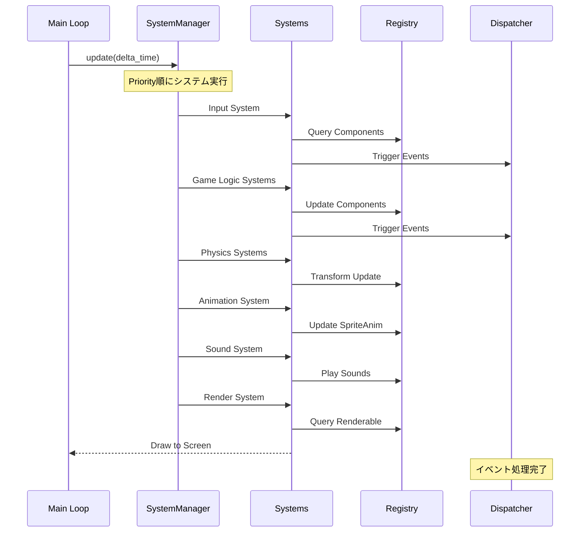
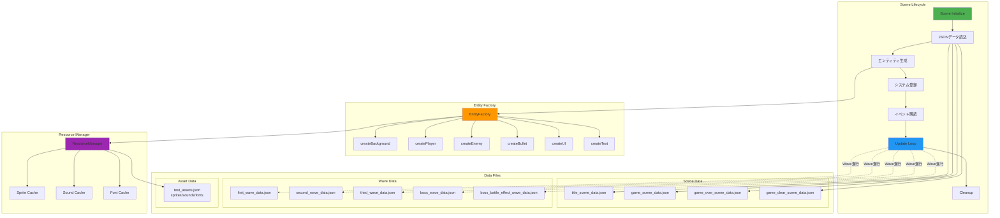
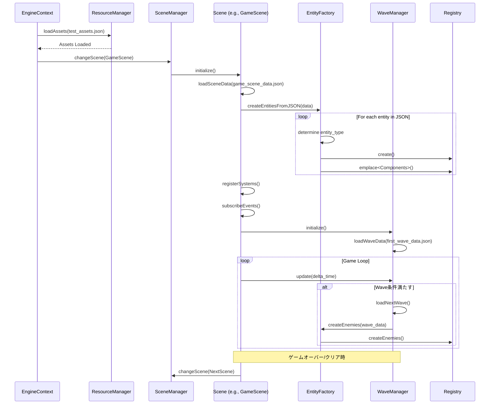
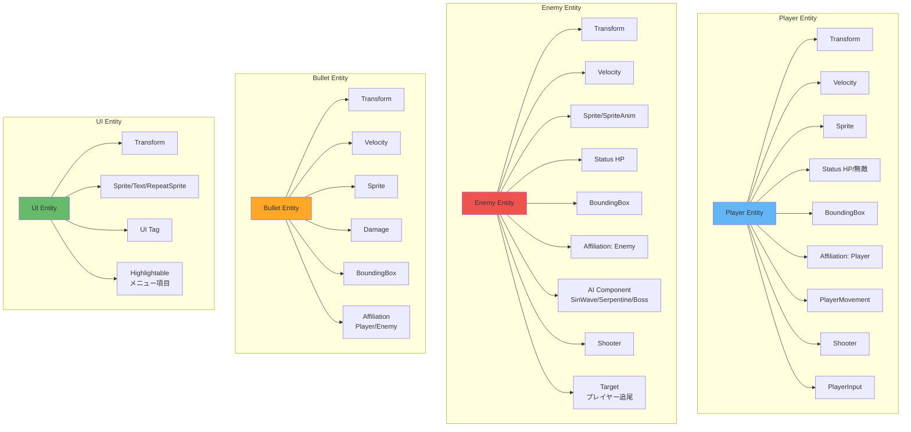

# BioArmada アーキテクチャ図

このドキュメントでは、BioArmadaゲームの全体的なアーキテクチャを説明します。

## 目次

1. [システム全体構成](#システム全体構成)
2. [エンジン層アーキテクチャ](#エンジン層アーキテクチャ)
3. [アプリケーション層アーキテクチャ](#アプリケーション層アーキテクチャ)
4. [ECS アーキテクチャとデータフロー](#ecs-アーキテクチャとデータフロー)
5. [シーン管理とデータ駆動](#シーン管理とデータ駆動)

---

## システム全体構成

BioArmadaは、カスタム2Dゲームエンジンの上に構築された縦スクロールシューティングゲームです。以下の図は、システム全体の構成を示しています。



---

## エンジン層アーキテクチャ

エンジン層は、ゲームの基盤となる汎用的な機能を提供します。

```mermaid
graph TB
    subgraph "Engine Core"
        EC[EngineContext<br/>SDL初期化/メインループ]
        GT[GameTimer<br/>DeltaTime/FPS管理]
        SD[SceneDependencies<br/>依存注入コンテナ]
    end
    
    subgraph "Managers"
        SM[SceneManager<br/>シーン遷移/フェード管理]
        SYM[SystemManager<br/>システム更新順序管理]
        RM[ResourceManager<br/>アセット読込/キャッシュ]
        IM[InputManager<br/>入力状態管理]
    end
    
    subgraph "Rendering"
        R[Renderer<br/>SDL_Renderer ラッパー]
        SL[SpriteLoader<br/>画像読込]
        SAL[SpriteAnimLoader<br/>アニメーション定義]
        FL[FontLoader<br/>フォント読込]
        C[Color<br/>色定義]
    end
    
    subgraph "Sound"
        SMX[SoundMixer<br/>SDL_mixer ラッパー]
        SndL[SoundLoader<br/>音声ファイル読込]
    end
    
    subgraph "Engine Systems"
        MS[MovementSystem<br/>移動処理]
        RS[RotateSystem<br/>回転処理]
        SS[ScaleSystem<br/>スケール処理]
        FS[FadeSystem<br/>フェード演出]
        SAS[SpriteAnimationSystem<br/>アニメーション更新]
        SndS[SoundSystem<br/>音声再生]
        SRS[SpriteRenderSystem<br/>スプライト描画]
    end
    
    subgraph "Engine Components"
        T[Transform<br/>位置/回転/スケール]
        V[Velocity<br/>速度]
        Spr[Sprite<br/>画像]
        SA[SpriteAnim<br/>アニメーション]
        Txt[Text<br/>テキスト]
        F[Fade<br/>フェード]
        BGM[BackgroundMusic<br/>BGM]
        SE[SoundEffect<br/>効果音]
    end
    
    subgraph "Events"
        EL[EventListener<br/>entt::dispatcher ラッパー]
        EngEvents[Engine Events<br/>Fade/Quit/AnimEnd]
    end
    
    EC --> SM
    EC --> SYM
    EC --> RM
    EC --> IM
    EC --> GT
    EC --> SD
    
    SM --> FS
    SYM --> MS
    SYM --> RS
    SYM --> SS
    SYM --> FS
    SYM --> SAS
    SYM --> SndS
    SYM --> SRS
    
    RM --> SL
    RM --> SAL
    RM --> FL
    RM --> SndL
    
    R --> SL
    R --> FL
    R --> C
    SMX --> SndL
    
    MS --> T
    MS --> V
    RS --> T
    SS --> T
    FS --> F
    SAS --> SA
    SndS --> BGM
    SndS --> SE
    SRS --> T
    SRS --> Spr
    SRS --> Txt
    SRS -.uses.-> R
    
    FS --> EngEvents
    SAS --> EngEvents
    EngEvents --> EL
    
    style EC fill:#ffeb3b
    style SM fill:#ffc107
    style R fill:#ff9800
    style SMX fill:#ff9800
    style EL fill:#f44336
```



---

## アプリケーション層アーキテクチャ

アプリケーション層は、ゲーム固有のロジックとコンテンツを実装します。

```mermaid
graph TB
    subgraph "Scenes"
        TS[TitleScene<br/>タイトル画面]
        GS[GameScene<br/>ゲームプレイ]
        GOS[GameOverScene<br/>ゲームオーバー]
        GCS[GameClearScene<br/>ゲームクリア]
    end
    
    subgraph "Game Systems - Input & UI"
        IS[InputSystem<br/>プレイヤー/メニュー入力]
        MS_UI[MenuSystem<br/>メニュー選択]
        HS[HighlightSystem<br/>UI ハイライト]
        LUS[LifeUISystem<br/>ライフ表示更新]
        SCS[ScoreSystem<br/>スコア管理]
        GOS_SYS[GameOverSystem<br/>ゲームオーバー処理]
    end
    
    subgraph "Game Systems - Movement"
        PMS[PlayerMovementSystem<br/>プレイヤー移動]
        EMS[EnemyMovementSystem<br/>敵移動パターン]
        FS_APP[FacingSystem<br/>向き制御]
        SBS[ScreenBoundsSystem<br/>画面境界判定]
        OOS[OutOfScreenSystem<br/>画面外削除]
        TLS[TransformLinkSystem<br/>親子関係追従]
    end
    
    subgraph "Game Systems - Combat"
        SS[ShootSystem<br/>射撃処理]
        CS[CollisionSystem<br/>衝突判定]
        HRS[HitResolutionSystem<br/>ダメージ/死亡処理]
        EAS[EnemyAISystem<br/>敵AI行動]
    end
    
    subgraph "Game Systems - Effects"
        SBS_EFF[SpriteBrinkSystem<br/>点滅演出]
        LCS[LifeCycleSystem<br/>エンティティ生成/削除]
    end
    
    subgraph "Game Components"
        subgraph "Entity Types"
            Player[Player<br/>プレイヤー]
            Enemy[Enemy/Boss<br/>敵キャラクター]
            Bullet[Bullet<br/>弾]
            UI[UI Elements<br/>メニュー/スコア/ライフ]
        end
        
        subgraph "Component Types"
            Stat[Status<br/>HP/無敵時間]
            Dmg[Damage<br/>攻撃力]
            BB[BoundingBox<br/>当たり判定]
            Aff[Affiliation<br/>所属(敵/味方)]
            PM[PlayerMovement<br/>移動パラメータ]
            Shoot[Shooter<br/>射撃パラメータ]
            AI[AI Components<br/>移動/攻撃パターン]
            Tgt[Target<br/>追尾対象]
        end
    end
    
    subgraph "Game Events"
        ShE[ShootEvent<br/>射撃]
        HE[HitEvent<br/>衝突]
        DE[DeadEvent<br/>死亡]
        GOE[GameOverEvent<br/>ゲームオーバー]
        KDE[KeyDownEvent<br/>キー入力]
        MBE[MenuButtonEvent<br/>メニュー操作]
    end
    
    subgraph "Waves & Session"
        WM[WaveManager<br/>ウェーブ進行管理]
        SS_DATA[SessionState<br/>ゲーム状態]
        EF[EntityFactory<br/>エンティティ生成]
    end
    
    TS --> MS_UI
    TS --> HS
    GS --> WM
    GS --> PMS
    GS --> SS
    GS --> CS
    GOS --> MS_UI
    
    IS --> KDE
    IS --> MBE
    MS_UI --> HS
    
    PMS --> PM
    PMS --> Player
    EMS --> AI
    EMS --> Enemy
    
    SS --> Shoot
    SS --> ShE
    CS --> BB
    CS --> HE
    HRS --> HE
    HRS --> DE
    HRS --> Stat
    EAS --> AI
    EAS --> Enemy
    
    WM --> EF
    WM --> SS_DATA
    EF --> Player
    EF --> Enemy
    EF --> Bullet
    EF --> UI
    
    HRS --> GOE
    GOE --> GOS_SYS
    
    style TS fill:#e1f5ff
    style GS fill:#e1f5ff
    style WM fill:#c8e6c9
    style EF fill:#c8e6c9
```

---

## ECS アーキテクチャとデータフロー

BioArmadaは、EnTTライブラリを使用したEntity-Component-System（ECS）パターンを採用しています。



### ECS 更新サイクル



---

## シーン管理とデータ駆動

BioArmadaは、JSON形式のデータファイルによるデータ駆動設計を採用しています。



### データ駆動フロー詳細



---

## コンポーネント構成図

以下は、主要なエンティティタイプとそれらが持つコンポーネントの関係を示しています。



---

## システム実行順序

SystemManagerは、登録されたシステムをpriority順に実行します。以下は典型的な実行順序です。

```mermaid
graph TD
    Start([Frame Start]) --> Input[Input System<br/>Priority: 0]
    
    Input --> GameLogic[Game Logic Systems<br/>Priority: 10-50]
    
    subgraph "Game Logic Phase"
        GameLogic --> Menu[Menu System]
        Menu --> PlayerMove[Player Movement]
        PlayerMove --> EnemyAI[Enemy AI]
        EnemyAI --> EnemyMove[Enemy Movement]
        EnemyMove --> Shoot[Shoot System]
    end
    
    Shoot --> Physics[Physics Systems<br/>Priority: 100-200]
    
    subgraph "Physics Phase"
        Physics --> Move[Movement System]
        Move --> Facing[Facing System]
        Facing --> Bounds[Screen Bounds]
        Bounds --> Collision[Collision System]
        Collision --> HitRes[Hit Resolution]
        HitRes --> OutOfScreen[Out Of Screen]
    end
    
    OutOfScreen --> Effects[Effect Systems<br/>Priority: 300-400]
    
    subgraph "Effects Phase"
        Effects --> Brink[Sprite Brink]
        Brink --> Fade[Fade System]
        Fade --> Scale[Scale System]
        Scale --> Rotate[Rotate System]
    end
    
    Rotate --> Fixed[Fixed Systems<br/>Priority: 1000+]
    
    subgraph "Fixed Systems Phase"
        Fixed --> Anim[Animation System<br/>Priority: 1000]
        Anim --> Sound[Sound System<br/>Priority: 2000]
        Sound --> Render[Render System<br/>Priority: 3000]
    end
    
    Render --> End([Frame End])
    
    style Start fill:#4caf50
    style End fill:#f44336
    style Input fill:#2196f3
    style GameLogic fill:#ff9800
    style Physics fill:#9c27b0
    style Effects fill:#00bcd4
    style Fixed fill:#795548
```



---

## まとめ

BioArmadaのアーキテクチャは以下の特徴を持ちます：

### 設計原則

1. **レイヤード・アーキテクチャ**
   - Engine層とApp層の明確な分離
   - 再利用可能なエンジンコンポーネント

2. **ECS パターン**
   - EnTTによる効率的なエンティティ管理
   - データ指向設計による高パフォーマンス
   - コンポーネントの組み合わせによる柔軟な機能拡張

3. **イベント駆動**
   - 疎結合なシステム間通信
   - entt::dispatcherによる型安全なイベント処理

4. **データ駆動設計**
   - JSONによるコンテンツの外部化
   - プログラマーとデザイナーの分業を促進
   - 迅速なイテレーション

5. **依存性注入**
   - SceneDependenciesによる依存管理
   - テスタビリティの向上

### 技術スタック

- **言語**: C++20
- **ECS**: EnTT
- **グラフィックス**: SDL3 / SDL3_image
- **オーディオ**: SDL3_mixer
- **データ**: nlohmann::json

### ディレクトリ構成

```
Game/
├── assets/              # 画像、音声、フォント
├── game_data/           # シーン、ウェーブデータ
└── source/
    ├── app/             # ゲーム固有実装
    │   ├── components/  # ゲームコンポーネント
    │   ├── events/      # ゲームイベント
    │   ├── scene/       # シーン実装
    │   ├── systems/     # ゲームシステム
    │   ├── session/     # ゲーム状態管理
    │   └── waves/       # ウェーブ管理
    └── engine/          # エンジン実装
        ├── components/  # エンジンコンポーネント
        ├── core/        # コアシステム
        ├── events/      # エンジンイベント
        ├── managers/    # 各種マネージャ
        ├── math/        # 数学ユーティリティ
        ├── rendering/   # 描画システム
        ├── scene/       # シーン基底
        ├── sound/       # サウンドシステム
        ├── systems/     # エンジンシステム
        └── utils/       # ユーティリティ
```

この設計により、BioArmadaは拡張性が高く、保守しやすい構造となっています。
