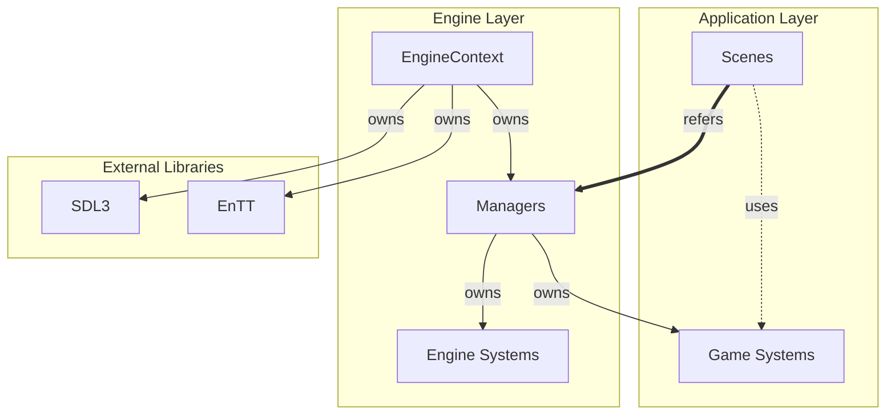
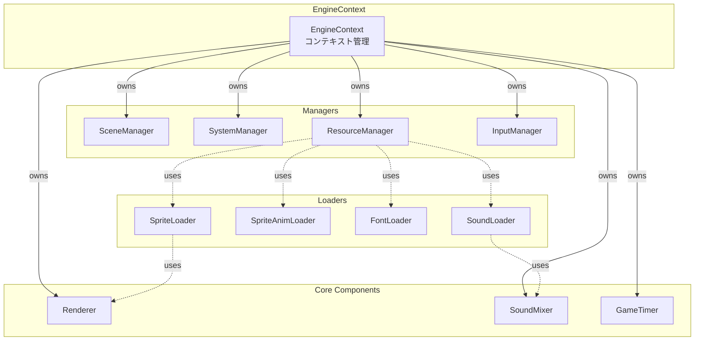
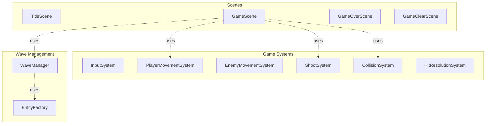
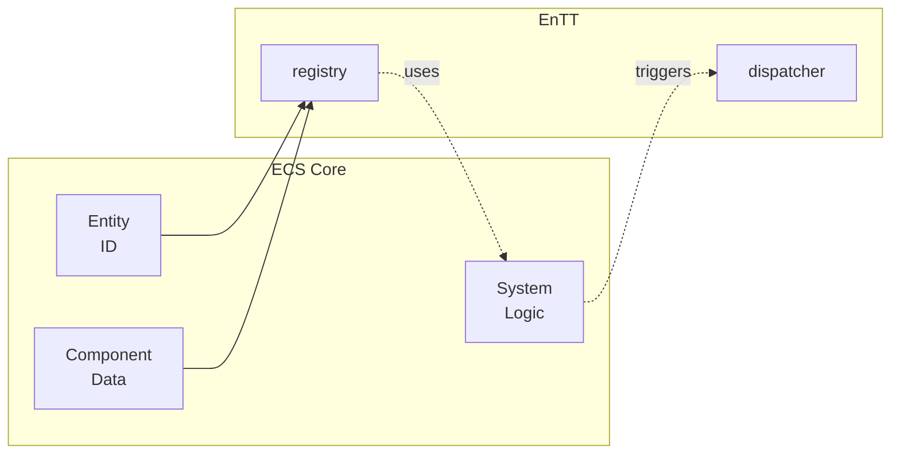
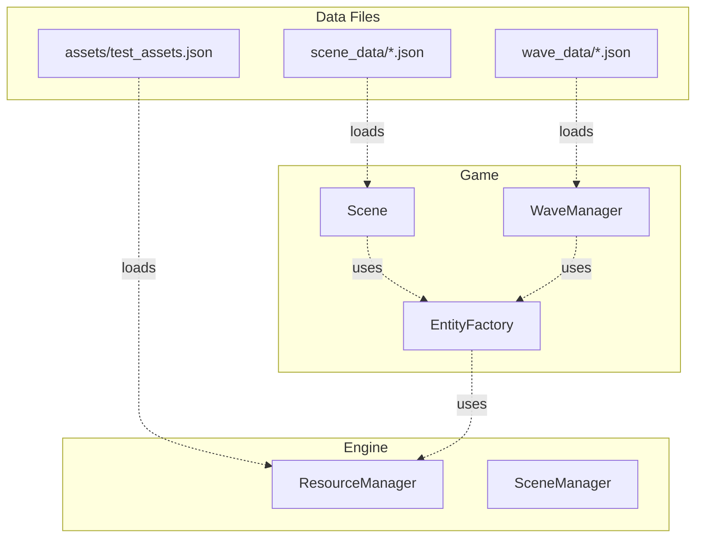

# BioArmada アーキテクチャ図

このドキュメントでは、BioArmadaゲームのアーキテクチャを説明します。

## 凡例

- **実線矢印 (→)**: 保持 (所有権を持つ)
- **点線矢印 (-.->)**: 使用 (一時的な参照)
- **太線矢印 (==>)**: 参照 (永続的な参照)

---

## システム全体構成

BioArmadaは、カスタム2Dゲームエンジンの上に構築された縦スクロールシューティングゲームです。



---

## エンジン層アーキテクチャ

エンジン層は、ゲームの基盤となる汎用的な機能を提供します。



---

## アプリケーション層アーキテクチャ

アプリケーション層は、ゲーム固有のロジックとコンテンツを実装します。



---

## ECS アーキテクチャ

BioArmadaは、EnTTライブラリを使用したEntity-Component-System（ECS）パターンを採用しています。



---

## データ駆動設計

JSONファイルによるデータ駆動設計を採用しています。



---

## まとめ

### 設計原則

1. **レイヤード・アーキテクチャ**: Engine層とApp層の明確な分離
2. **ECS パターン**: EnTTによる効率的なエンティティ管理
3. **イベント駆動**: 疎結合なシステム間通信
4. **データ駆動設計**: JSONによるコンテンツの外部化

### 技術スタック

- **言語**: C++20
- **ECS**: EnTT
- **グラフィックス**: SDL3 / SDL3_image
- **オーディオ**: SDL3_mixer
- **データ**: nlohmann::json

### ディレクトリ構成

```
Game/
├── assets/              # 画像、音声、フォント
├── game_data/           # シーン、ウェーブデータ
└── source/
    ├── app/             # ゲーム固有実装
    │   ├── components/  # ゲームコンポーネント
    │   ├── events/      # ゲームイベント
    │   ├── scene/       # シーン実装
    │   ├── systems/     # ゲームシステム
    │   └── waves/       # ウェーブ管理
    └── engine/          # エンジン実装
        ├── components/  # エンジンコンポーネント
        ├── core/        # コアシステム
        ├── managers/    # 各種マネージャ
        ├── rendering/   # 描画システム
        ├── sound/       # サウンドシステム
        └── systems/     # エンジンシステム
```
